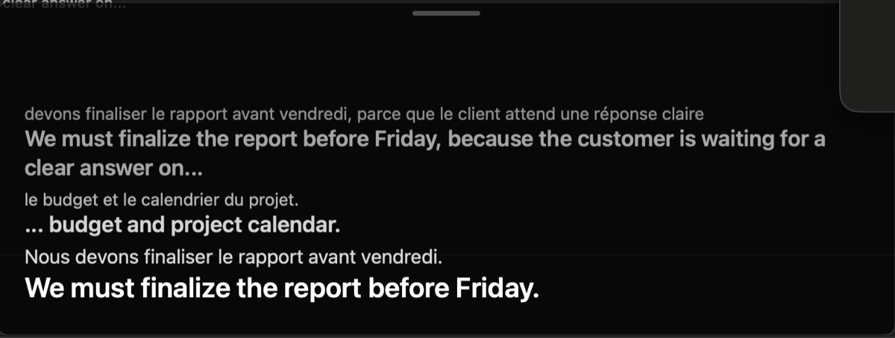

# CaptionBridge

**Live, private French → English subtitles for any meeting on your Mac.**

CaptionBridge listens to your Mac's system audio (Teams, Zoom, Meet, a browser tab — anything) and floats a subtitle overlay over your meeting: the French line appears as it's spoken, the polished English translation follows seconds later. Everything runs **100% on-device** — no cloud, no account, no audio ever leaves the Mac.

<p align="center">
  
</p>
<p align="center"><em>The live overlay during a real captioning session: French appears as it's spoken, English follows — including a long sentence split mid-way and continued with "…".</em></p>

## Why this exists

Meetings move fast when they're not in your strongest language. Live translated captions close that gap — but in many workplaces the built-in transcription and translation features of meeting tools are switched off for confidentiality reasons, and sending meeting audio to a cloud captioning service is a non-starter for the same reason.

CaptionBridge was built for exactly that everyday situation. It produces live, translated subtitles **entirely on the Mac itself**: nothing is recorded, nothing leaves the machine, and it works with any meeting app because it listens to system audio instead of plugging into the meeting software.

I'm an operations/PMO professional rather than a professional developer — I build working software by directing AI coding tools. CaptionBridge was built with **OpenAI Codex** and then deeply revised — performance, stability, and a full multi-angle code review — with **Claude Code**. Every architectural decision (latency budgets, privacy constraints, failure recovery) came from watching the app in daily real-world use and iterating.

## Features

- **Floating subtitle overlay** that stays above fullscreen meeting apps, drag-anywhere, remembers its position, three sizes.
- **Live French draft line** appears while the speaker is still talking; a **polished English final** lands at each pause.
- **Instant English drafts** (macOS 15+): the live French line is additionally translated on-device with Apple Translation, so English updates mid-sentence instead of only at pauses.
- **Any audio source**: system audio, Microsoft Teams specifically, or the microphone.
- **Bilingual or English-only** display, plus an in-session transcript panel (never saved to disk).
- **Local Whisper models** from 142 MB to 1.5 GB — pick your speed/quality/memory trade-off in the app; downloads are verified against pinned SHA-256 checksums.
- **Self-healing captioning pipeline**: model stays loaded across the whole meeting, slow sentences never kill the translator, audio capture auto-reconnects if macOS interrupts it.

## Privacy, by construction

- Speech recognition and translation run in a bundled [whisper.cpp](https://github.com/ggerganov/whisper.cpp) process with Metal GPU acceleration — on your Mac, offline.
- Optional instant English drafts use Apple's on-device Translation framework (the language pack downloads once from Apple; translation itself is offline).
- No analytics, no accounts, no network use except the one-time model download from Hugging Face.
- Captions live in memory for the current session only; nothing is written to disk.

## How it works

```
Meeting audio (ScreenCaptureKit / AVAudioEngine)
        │  16 kHz mono PCM, ordered stream
        ▼
LiveSubtitleCoordinator (Swift actor)
  • voice-activity gating + utterance windowing
  • paces drafts to what the machine can sustain
        │                       │
        │ every ~0.6 s          │ at each pause
        ▼                       ▼
   French draft            English final
 (Whisper transcribe)   (Whisper translate — single pass
        │                when drafts cover the utterance)
        ▼
 Instant English draft (Apple Translation, macOS 15+)
        │
        ▼
SwiftUI control window + AppKit floating overlay
```

The Whisper helper is a small C program that keeps the model **loaded in memory for the whole meeting** and answers transcription/translation requests over a pipe protocol with request IDs — so one slow sentence can only ever delay a caption, never force a multi-second model reload mid-meeting.

## Install

**Requirements:** Apple silicon Mac, macOS 14+ (macOS 15+ for instant English drafts).

1. Download `CaptionBridge.dmg` from the [latest release](https://github.com/Ata-7/captionbridge/releases), open it, and drag CaptionBridge to Applications.
2. First launch: the app is ad-hoc signed (not notarized), so **right-click → Open → Open**.
3. In the app, download a model (see table below).
4. Click **Start Subtitles** and grant *Screen & System Audio Recording* permission when macOS asks. Relaunch the app after granting.
5. Play any French audio — captions appear in the overlay.

### Which model should I pick?

| Model | Size | Quality | Best for |
|---|---|---|---|
| Base | 142 MB | basic | very old/low-RAM Macs |
| Small | 466 MB | good | fast captions on any Apple silicon |
| **Medium compact** | **514 MB** | **near-best** | **MacBook Air / 8–16 GB Macs** |
| Medium | 1.5 GB | best | Macs with 24 GB+ memory |

On a fanless MacBook Air running Teams, **Medium compact** is the sweet spot: near-Medium accuracy with a third of the memory footprint and much faster load.

## Build from source

Requires full Xcode on Apple silicon.

```sh
swift test                          # unit tests
python3 -m pip install --upgrade --target .build/python-packages cmake
Scripts/bootstrap-whisper.cpp.sh    # builds whisper.cpp (Metal) once
Scripts/package-app.sh              # builds dist/CaptionBridge.app
Scripts/create-dmg.sh               # builds dist/CaptionBridge.dmg
```

End-to-end verification (synthesizes French speech, runs it through the real bundled helper, checks the English output):

```sh
Scripts/verify-local-translation.sh
```

`Scripts/verify-live-system-audio.sh` additionally exercises the full live system-audio path once Screen & System Audio Recording permission is granted.

## Built with AI, deliberately

This repository is also a demonstration of a working method: **product thinking + AI pair-programming**.

- v0.1 was built end-to-end with OpenAI Codex from a problem statement and iterative feedback.
- v0.2 came from a structured Claude Code session: a 10-angle automated code review (correctness, concurrency, efficiency, security), micro-benchmarks of the actual Whisper helper to pick optimizations by measurement (one "obvious" optimization was rejected because the numbers said no), then fixes for every confirmed finding — including a process-lifecycle redesign that eliminated mid-meeting model reloads, a 2× faster final-caption path, and crash fixes for real-world edge cases.

The point isn't that AI wrote the code. It's that a clear problem, honest verification, and relentless iteration produce software that solves a real need — regardless of who types the semicolons.

## Roadmap

- More language pairs (the pipeline is language-agnostic; UI and non-speech filters need generalizing)
- Notarized releases with a Developer ID certificate (packaging already applies hardened runtime + timestamp when `CAPTIONBRIDGE_CODESIGN_IDENTITY` is set)
- VoiceOver announcements and keyboard access for the overlay
- Saved transcripts as an explicit opt-in export

## License

[MIT](LICENSE) — © 2026 Mustafa Ataoğlu. Bundled third-party components are listed in [THIRD-PARTY-NOTICES.md](THIRD-PARTY-NOTICES.md).
